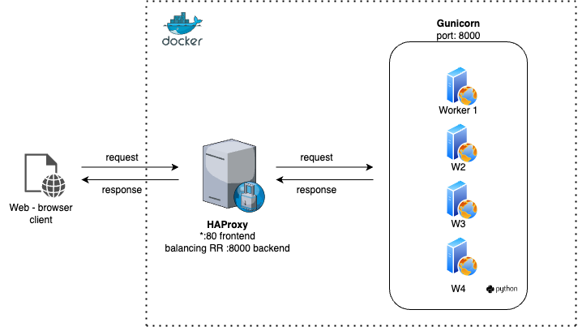

# INTRODUCCIÓN

Documentación sobre reto técnico propuesto para vacante DevOps en Appgate. El reto consiste en dos fases, una actividad analítica y otra resolutiva. Ambas relacionadas con contenedores y buenas prácticas.


## Contenido

### *1. Docker + Troubleshooting*
- #### *1.1. Analizar problemática*
- #### *1.2. Mejoras u optimizaciones*
- #### *1.3. Como monitorear (logs)*
### *2. Ejercicio Práctico*


---

## 1. Docker + Troubleshooting

- Stack Tecnológico: Flask + gunicorn + haproxy + Docker

<br>
<br>

<center>



</center>

### ***1.1. Analizar problemática***

 - Hacer un análisis con lo expuesto en el pdf que se encuentra en este repositorio con nombre `reto-tecnico` e identificar que errores considera que se están cometiendo.

***R://*** 

Para solventar temas de indisponibilidad se recomienda usar gestión de autoescalado con kubernetes o docker swarm. Si esto no es posible, usar algun servicio cloud de autoscaling.

Para que las aplicaciones autoescalen, se requiere que el contenedor muera o reporte alguna falla cuando esta se presente. Para ello es vital el manejo del PID (procesos) y el manejo de señales en los contenedores. Las señales de linux son una herramienta muy importante para identificar el ciclo de vida de la aplicación, en este caso corriendo sobre un contenedor. El primer proceso que se inicia en un contenedor es el PID1 (Identificadores de procesos), por ende, docker y k8s se comunican con señales linux hacia este proceso PID1 para terminarlos o gestionarlos. Las señales no alcanzan a tener visibilidad a procesos alternos como PID2, PID3, ..., PIDn.

En el ejercicio propuesto, usa 'CMD ["/bin/docker-entrypoint"]' lo que hace es pasar a ejecutar un shell en un proceso PID2, por lo cual, cuando la aplicación presenta alguna intermitencia o caída (desbordamiento de memoria tambien aplica en este escenario), docker no se da cuenta, por ende no termina el contenedor. Esto cuando estamos sobre alguna gestión de autoescalamiento (preferiblemente k8s) significa que la aplicación experimentará downtime y el Deployment y los HPA no gestionarán las replicas (replicaSet). 

Se recomienda usar el CMD o ENTRYPOINT en el Dockerfile y ejecutar los comandos directamente allí, ejemplo: `CMD ["gunicorn", "main:app", "-w", "4", "-b", "0.0.0.0:8000"]`.

<br>
<br>


### ***1.2. Mejoras u optimizaciones***
-  Que mejoras y/u optimizaciones se pueden llevar a cabo.

***R://*** 

1.2.1. Lo primero es cambiar la imagen.  Para las dependencias que necesitamos, Alpine se queda corta, adicional, ha tenido en los ultimos tiempos mucha fricción y mas con el ecosistema python. Prefiero usar una imagen basada en debian como lo puede ser: python:3.9-slim-buster la cual trae los paquetes necesarios para python, adicional, es idonea para el reto tecnico propuesto.  Es muy pequeña (no tanto como alpine pero sigue siendo demasiado pequeña). Se recomienda no usar imagenes @latest ya que pueden traer inestabilidad.


1.2.2. Al ejecutar varios RUN en el Dockerfile los cuales conllevan acciones del mismo contexto se sacrifica el cache, la idea es que esas necesidades vayan en la misma declaracion RUN, ejemplo :

```
 RUN apk add py3-pip build-base python3-dev libffi-dev openssl-dev
     apk add haproxy
     apk add nginx
```


Se recomienda ordenar dichos argumentos alfanumericamente, ejemplo:


```
RUN apt-get update && apt-get install -y \
  bzr \
  cvs \
  git \
  mercurial \
  subversion \
  && rm -rf /var/lib/apt/lists/*
```


1.2.3. Otro tema a tener en cuenta, de forma, es el archivo en la linea del Dockerfile `ADD ./haproxy.conf /etc/haproxy/haproxy.cfg` lo ideal es que para probar en local sin docker, el archivo se llame haproxy.cfg.

1.2.4. Lo ideal es un contenedor (Dockerfile) por servicio. Depronto es mas beneficioso separar las responsabilidades del haproxy frente a la aplicación. No estoy seguro ya que no he trabajado con haproxy, pero de cara a un balanceador, se considera un componente de la arquitectura y se puede desplegar independientemente.

<br>

### ***1.3. Como monitorear (logs)***
  
   - Como SysAdmin, ¿Cómo se manejaría los logs y de qué forma se presentarán para ser usado en una herramienta de monitoreo?

***R://***

Lo ideal es abordar el tema de monitoreo con pilares de la Observabilidad. Debemos garantizar trazas, logs y metricas. 

Con haproxy hay integraciones con prometheus y grafana, lo cual nos permite adoptar stack tecnológico opensource. 

Adicional, para exponer un front con las [metricas de haproxy](https://www.dennisotugo.com/how-to-enable-metrics-stats-page-in-haproxy/), basta con agregar un bloque en el haproxy.cfg declarando la habilitación de las metricas, ejem:

```
frontend stats
    bind *:8404
    stats enable
    stats uri /stats
    stats refresh 10s
```


Para darle mas objetividad al tema de observabilidad, mi recomendación es abordar una estrategia mas completa en casos donde las aplicaciones son críticas para el negocio. Adicional, donde las aplicaciones son altamente distribuidas.

Desde la imagen Dockerfile de cada componente agregar un [agente de Opentelemetry](https://opentelemetry.io/docs/instrumentation/python/) el cual nos va permitir instrumentar según el lenguaje de la aplicación. Este se encargará de enviar trazas, logs y metricas.

Quien se encargará de recolectar estas metricas, adaptar los protocolos y formatos a los interesados será el [Colletor Opentelemetry](https://opentelemetry.io/docs/collector/). Este componente tiene la capacidad de atender a diferentes interesados como: jaeger, zipkin, prometheus, ELK, datadog, dynatrace, entre muchos otros.
El concepto principal de Opentelemetry es estandarizar la manera de como las aplicaciones envian la información a los backends de observabilidad, y [otel es completamente opensource](https://www.cncf.io/projects/opentelemetry/).

Luego, quedaria la visualización, y sin lugar a dudas, grafana es un gran actor en esta finalización, el cual nos va a permitir tener dashboard personalizados, preconstruidos, y demás.

Por último, Alertmanager, quien nos comunicará alertamientos en casos de fallo o necesidades puntuales a notificar.

Este es un gráfico que nos orienta en la estrategia antes mencionada.

<center>


</center>


<br>
<br>
<br>

## ***2. Ejercicio Práctico***

Nos piden:
- Aplicar las mejoras propuestas en el punto 1.
- Implemente kubernetes e incluya los probes. Imagen en dockerhub publica.
- implemente prometheus para visualizar las metricas.

<br>

<center>


</center>

- Estructura del repositorio:
  
```
├── Readme.md
├── __pycache__
│   └── main.cpython-39.pyc
├── app
│   ├── Dockerfile
│   ├── docker-compose.yml
│   ├── haproxy.cfg
│   ├── main.py
│   └── requirements.txt
├── images
│   └── otel.png
├── justificacion.md
├── k8s
│   ├── Deployment.yml
│   ├── Hpa.yml
│   └── Service.yml
├── monitoring
│   ├── alertmanager
│   │   ├── configmap-alertamanager.yml
│   │   ├── configmap-template-alertmanager.yml
│   │   ├── deployment-alertmanager.yml
│   │   └── service-alertmanager.yml
│   ├── grafana
│   │   ├── datasource-config.yml
│   │   ├── deployment.yml
│   │   └── service.yml
│   ├── kube-static.metrics
│   │   ├── cluster-role-binding.yml
│   │   ├── cluster-role.yml
│   │   ├── deployment.yml
│   │   ├── service-account.yml
│   │   └── service.yml
│   └── prometheus
│       ├── clusterole.yml
│       ├── config-map.yml
│       ├── deployment.yml
│       └── service.yml
└── reto-tecnico.pdf
```


- El código fuente (hello world en flask) y Dockerfile están en la carpeta `app`. Si se requiere construir la imagen docker se debe hacer desde esta carpeta para que no se copien los demás arcnivo innecesarios para ese momento. La aplicación expone su entrypoint en http://localhost:8000.

- En la carpeta `k8s` se encuentran los manifiestos necesarios para la aplicacion en kubernetes. El deployment, service y hpa. Al interior del deployment están los probes necesarios.
  la imagen docker está publicada en dockerhub: maupuert/reto-appgate:latest

- En la carpeta monitoring se encuentra 4 subcarpetas:

  - prometheus: Para recolectar las métricas.
  - kube state metrics: Para pasarle datos adicionales del cluster prometheus y al visualizador.
  - grafana: front para visualizar los dashboard con sus metricas.
  - alertmanager: Módulo para generar alertas.

Es importante mencionar que el monitoreo se instala en el mismo cluster (minikube) en un namespace llamado `monitoring`.

**Nota**: Estas implementaciones se hicieron bajo minikube simulando un cluster en local. Por ende, para exponer diferentes endpoints (services) en local se debia hacer con `port-forward`. Se debe tener muy encuenta.

Adicional, esta implementación genera un dashboard que se expone con '`minikube dashboard`':


<br>

En la carpeta `images` se encuentran los diagramas a alto nivel.


El módulo de `alertmanager` está notificando una de las alertas configuradas en Slack (posible desborde de memoria del pod):

<br>

<center>

[alerting-slack](images/alerting-slack.png)

</center>


